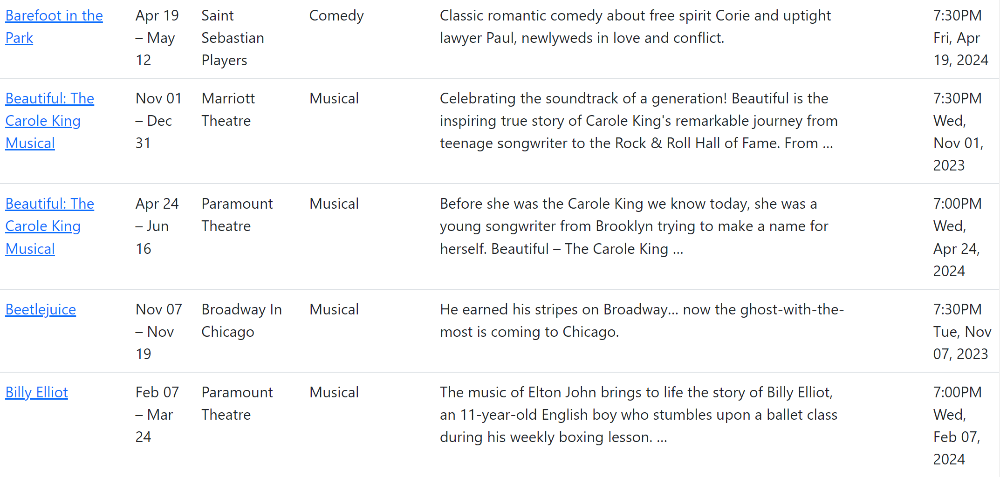

## Theater plays in Chicago

### What is it?

This is a web scraping based application that provides a table with list of theatrical events in Chicago, IL, and its closest suburbs.

You can filter the list by:
- **Date**
- **Price**
- **Genres**

### How does it look like?

Pretty simple:


## How to run?

**Requirements**

- Docker

If you don't have Docker, you can download it [here](https://www.docker.com/products/docker-desktop).

<details>
  <summary>In case you don't want to use Docker, check out instructions under this spoiler.
</summary>

**Requirements**

- JDK 17 or newer
- Maven
- PostgreSQL
- Git

### Steps

**1. Clone the repository and navigate to the project directory**

```bash
$ git clone https://github.com/Kidchai/ChicagoPlays.git
$ cd ChicagoPlays
```

**2. Create a database in PostgreSQL**

```sql
CREATE DATABASE your_database_name;
```

**3. Set up the connection to the PostgreSQL database in the *application.properties* file.**

Navigate to the *application.properties* file located in the *src/main/resources* directory and update the following properties:

```properties
spring.datasource.url=jdbc:postgresql://localhost:5432/chicago_plays
spring.datasource.username=postgres
spring.datasource.password=postgres
```

Replace *chicago_plays*, *postgres*, and *postgres* with the database name, username, and password.

**4. Install dependencies and build the project**

```bash
$ mvn clean install
```

**5. Run the application**

```bash
$ mvn spring-boot:run
```

Now you need just open your web browser and navigate to http://localhost:8080/events. And push the button "Refresh" to get latest events' data.

If you want to run unit tests, run the:

```bash
$ mvn test
```
</details>

**1. Clone the repository and navigate to the project directory**

```bash
$ git clone https://github.com/Kidchai/chicago-plays.git
$ cd chicago-plays
```

**2. Start the application and database using Docker**

```bash
$ docker-compose up
```

Now you need just open your web browser and navigate to http://localhost:8080/events. And push the button "Refresh" to get latest events' data.

### Stack

Java, Spring Boot, PostgreSQL, H2, Maven, HtmlUnit, JUnit, Thymeleaf.

## Credits

[chicagoplays.com](https://chicagoplays.com/) is a theatrical events data extraction source.